**Universidad de San Carlos de Guatemala Redes de Computadoras 1 N**

**Segundo Semestre 2022**

**Practica 1**

**Grupo 11**

|**Nombre**|**carne**|**client**|**vpn ip**|**MAC**|
|---|---|---|---|---|
|José Alberto Alarcón Chigua|201346084|client1|10.8.0.2|00:50:79:66:68:01|
|Marvin Eduardo Catalán Véliz|201905554|client2|10.8.0.4|00:50:79:66:68:00|
|Julio José Orellana Ruíz|201908120|client3|10.8.0.5|00:50:79:66:68:02|
|Kenny Steven Rodas Velasquez|201602894|client4|10.8.0.3|00:50:79:66:68:04|
|Sara Paulina Medrano Cojulún|201908053|client5|10.8.0.6|00:50:79:66:68:03|

||**JOSE**|**MARVIN**|**JULIO**|**KENNY**|**SARA**|
|---:|---|---|---|---|---|
|**JOSE**||L54321 R12345|L54321 R12345|L54321 R12345|L54321 R12345|
|**MARVIN**|L54321 R12345||L54321 R12345|L54321 R12345|L54321 R12345|
|**JULIO**|R54321 L12345|R54321 L12345||R54321 L12345|R54321 L12345|
|**KENNY**|L12345 R54321|L12345 R54321|L54321 R12345||L54321 R12345|
|**SARA**|L54321 R12345|L12345 R 54321|R12345 L54321|L12345 R 54321||

**Configuracion VPCs**

**José Alberto Alarcón Chigua Cliente1>192.168.111.10 255.255.255.0 192.168.111.1**

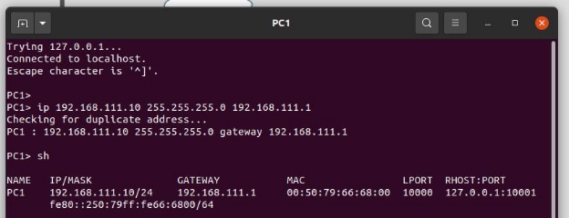

**Marvin Eduardo Catalán Véliz**

**Cliente 2>192.168.111.20 255.255.255.0 192.168.111.1**

**Julio José Orellana Ruíz**

**Cliente3>192.168.111.30 255.255.255.0 192.168.111.1**

**Kenny  Steven Rodas Velasquez Cliente4>192.168.111.40 255.255.255.0 192.168.111.1**

**Sara Paulina Medrano Cojulún**

**201908053**

**Cliente5>192.168.111.50 255.255.255.0 192.168.111.1**

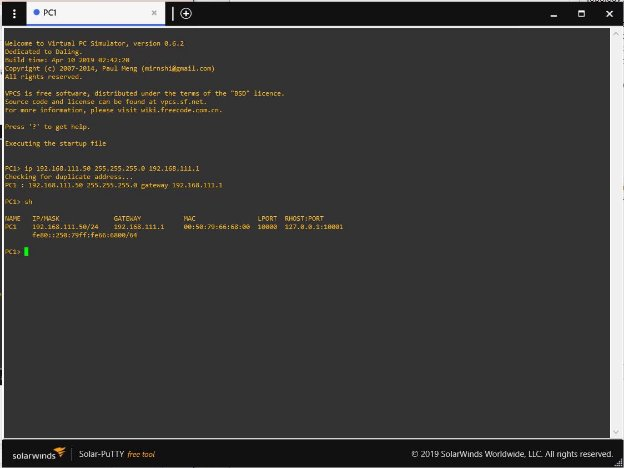

**Configuración de las nubes** José Alberto Alarcón Chigua Cloud\_Marvin

Cloud\_Julio

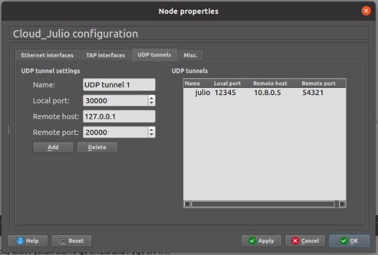

Cloud\_Kenny

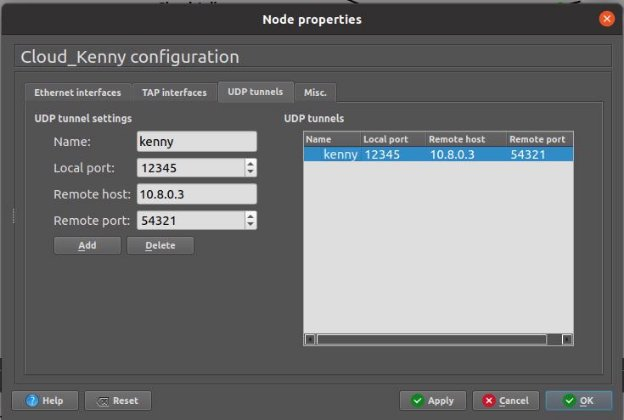

Cloud\_Sara

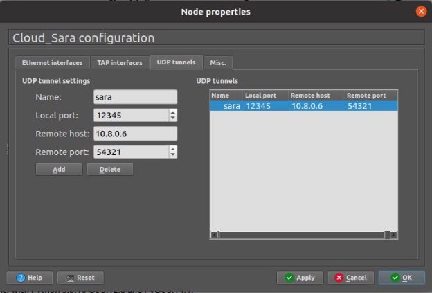

Marvin Eduardo Catalán Véliz 
Cloud\_Jose

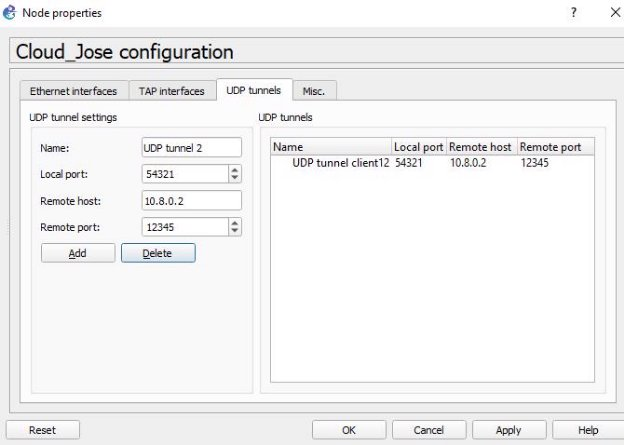

Cloud\_Julio

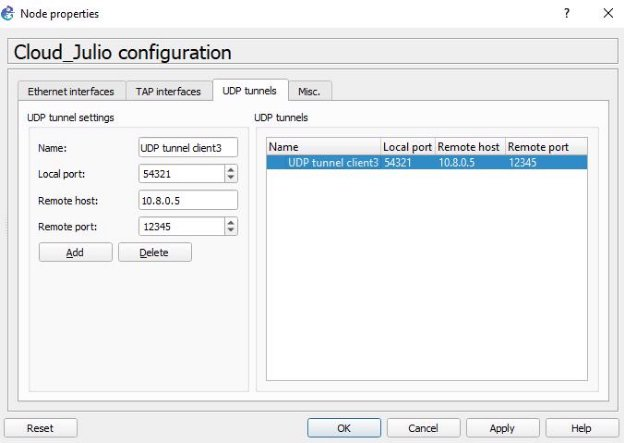

Cloud\_Kenny

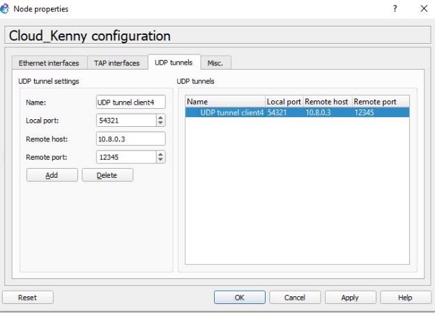

Cloud\_Sara

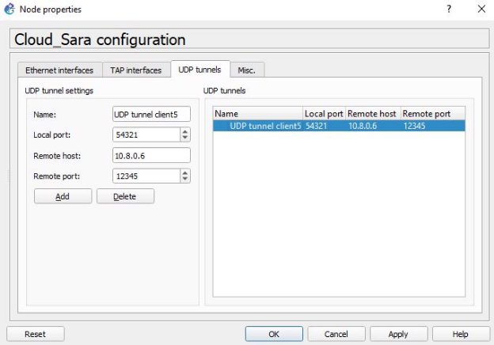

Julio José Orellana Ruíz 
Cloud\_Jose

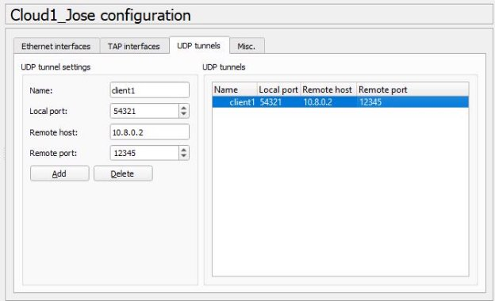

Cloud\_Marvin

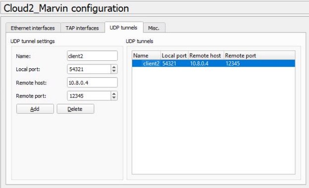

Cloud\_Kenny

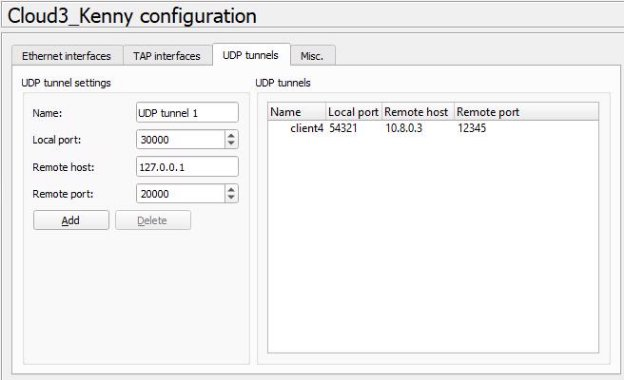

Cloud\_Sara

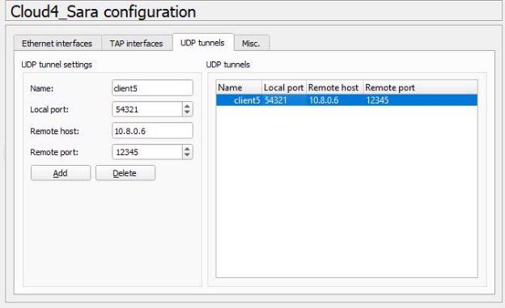

Kenny Steven Rodas Velasquez 
Cloud\_Jose

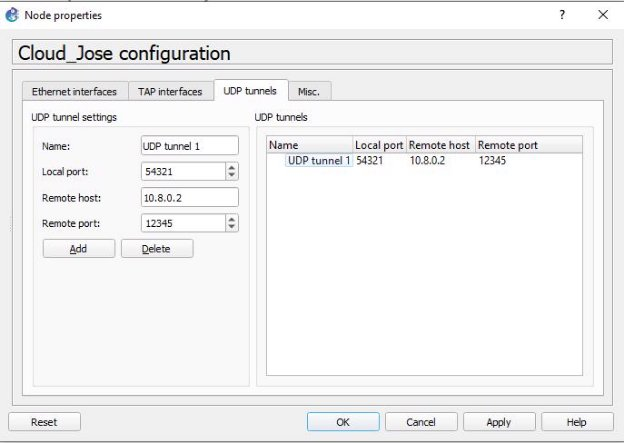

Cloud\_Marvin

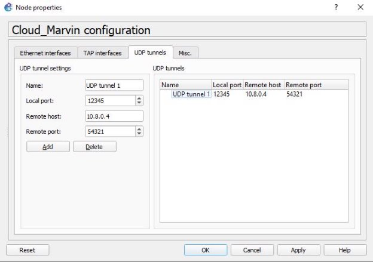

Cloud\_Julio

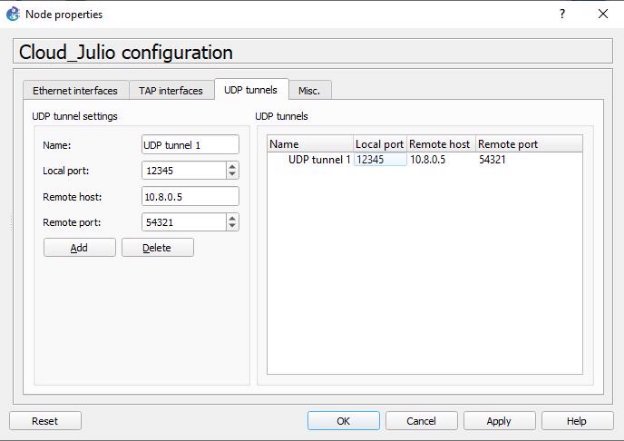

Cloud\_Sara

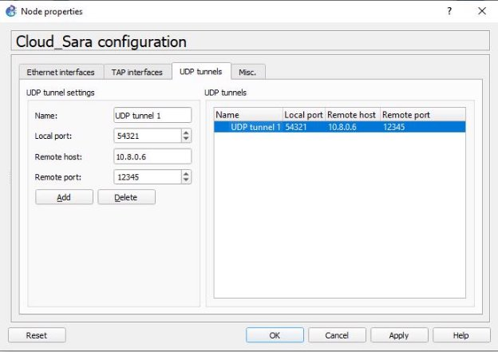

Sara Paulina Medrano Cojulún Cloud\_Jose

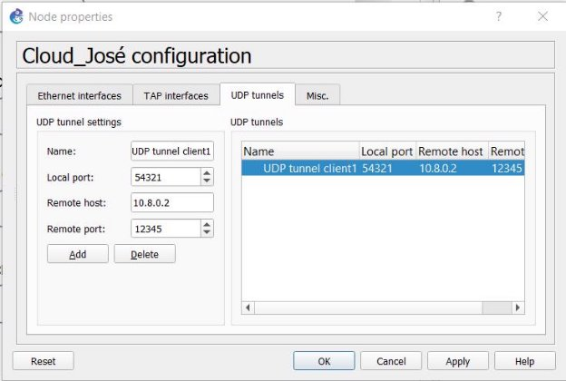

Cloud\_Marvin

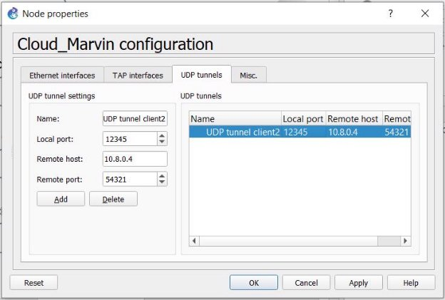

Cloud\_Julio

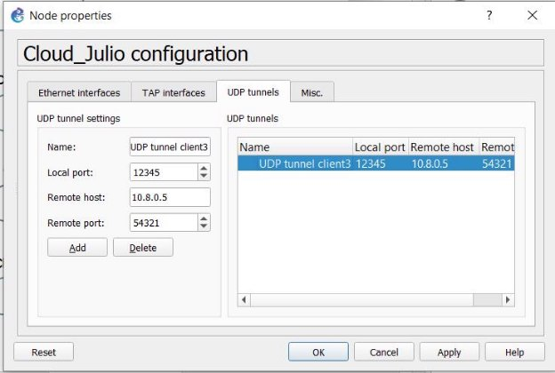

Cloud\_Kenny

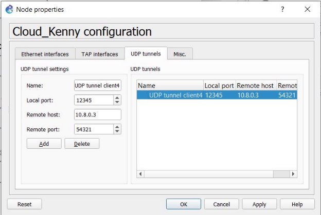

**Ping a clientes**

José Alberto Alarcón Chigua 
Cloud\_Marvin>ping 192.168.111.20

Cloud\_Julio>ping 192.168.111.30

Cloud\_Kenny>ping 192.168.111.40

Cloud\_Sara>ping 192.168.111.50

**Marvin Eduardo Catalán Véliz** 
Cloud\_Jose>ping 192.168.111.10

Cloud\_Julio>ping 192.168.111.30

Cloud\_Kenny>ping 192.168.111.40

Cloud\_Sara>ping 192.168.111.50

**Julio José Orellana Ruíz** 
Cloud\_José>ping 192.168.111.10

Cloud\_Marvin>ping 192.168.111.20

**Cloud\_Kenny>ping 192.168.111.40**

**Cloud\_Sara>ping 192.168.111.50**

**Kenny Steven Rodas Velasquez **

Ping jose

Ping marvin

Ping julio

Ping Sara

**Sara Paulina Medrano Cojulún** 
**Cloud_José>ping 192.168.111.10**

**Cloud\_Marvin>ping 192.168.111.20**

**Cloud\_Julio>ping 192.168.111.30**

**Cloud\_Kenny>ping 192.168.111.40**

